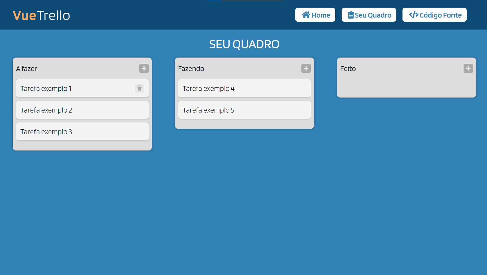

<h1 align="center">
  :clipboard: Vue Trello Clone :clipboard:
</h1>

<h4 align="center">
  Clone da página inicial da aplicação web do Trello <a href="https://trello.com">Trello</a> application
</h4>

<p align="center">
  
  
</p>

<p align="center">
  <a href="#technologies">Used Technologies</a>&nbsp;&nbsp;&nbsp;|&nbsp;&nbsp;&nbsp;
  <a href="#objective">The project's objective</a>&nbsp;&nbsp;&nbsp;|&nbsp;&nbsp;&nbsp;
  <a href="#final-result">Final Result</a>&nbsp;&nbsp;&nbsp;|&nbsp;&nbsp;&nbsp;
  <a href="#how-to-use">How to Run</a>
</p>

<p align="center">
   <br>
  <a href="https://vue-trello-clone20.netlify.app/" target="_blank">
    
  </a>
</p>

<h2 id="techonologies" name="technologies">
  :rocket: Used Technologies
</h2>

- [Vue.js](https://br.vuejs.org)
- [Sweet Alert](https://sweetalert.js.org/)
- [Vue Smooth Dnd](https://kutlugsahin.github.io/vue-smooth-dnd/#/cards)
- [Sass](https://sass-lang.com/)


<h2 id="objective" name="objective">
  :dart: Objetivo do projeto
</h2>

O objetivo do projeto é mostrar a construção de uma página web utilizando Vue.Js aplicando drag and drop

<h2 id="how-to-use" name="how-to-use">
  :information_source: Como rodar
</h2>

Para rodar o projeto basta seguir os passos:

```bash
# Clone the repository in some directory of your computer
$ git clone https://github.com/diego64/clone_trello.git

# Enter in the repository
$ cd clone_trello

# Install the dependencies
$ yarn install

# Start the app
$ yarn start
```

Após desses passos, a aplicação irá abrir na `localhost:8080`.
---